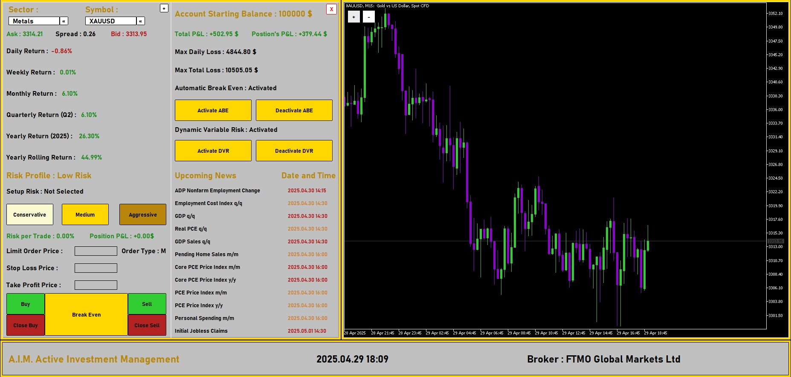
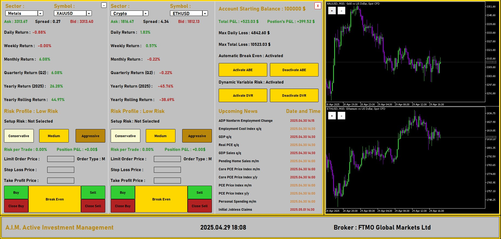

# AIM – Active Investment Management Dashboard

**AIM** è una dashboard avanzata per la gestione attiva degli investimenti, progettata per trader discrezionali e semi-automatizzati. L'interfaccia fornisce una panoramica operativa completa su qualsiasi strumento finanziario reso disponibile dal broker, con gestione del rischio incorporata, metriche di performance in tempo reale e setup operativi intelligenti.

> L'immagine fornita è un esempio rappresentativo dell'interfaccia utente. I simboli e il broker sono personalizzabili e non vincolati.

---

##  Caratteristiche principali

### Monitoraggio strumenti finanziari (dinamico e personalizzabile)
- Supporto completo per **tutti gli asset disponibili dal broker**: indici, valute, materie prime, criptovalute, ecc.
- Visualizzazione real-time dei prezzi Ask/Bid e spread
- Calcolo automatico dei ritorni temporali:
  - Giornaliero, Settimanale, Mensile, Trimestrale, Annuale
  - Rolling Yearly Return (rendimento annuale mobile)
- Classificazione automatica del profilo di rischio per ciascun asset/strumento

###  Gestione del rischio integrata
- Impostazioni configurabili per ogni trade:
  - Prezzo di ingresso, Stop Loss, Take Profit
  - Percentuale di rischio per operazione
- Ordini Market o Limit con controllo diretto
- Switch per **Break Even automatico**
- Calcolo dinamico dei lotti basato sul rischio impostato

### Analisi performance del conto
- Saldo iniziale personalizzabile
- Profit & Loss totale e per posizione
- Monitoraggio delle soglie di perdita massima (giornaliera e totale)

### Architettura modulare
- UI indipendente e integrabile in piattaforme esistenti
- Compatibilità estendibile a più broker
- Ottimizzata per essere usata con strategie discrezionali e sistemi di supporto decisionale (es. macroeconomia, pattern tecnici, driver di trend)

---

## Visione

**AIM** è pensato per colmare il gap tra analisi qualitativa e operatività concreta. In mercati complessi e ad alta volatilità, l'efficienza decisionale è tutto: AIM offre un’interfaccia strategica e misurabile per gestire capitale, rischio e opportunità in modo professionale.

> Built for execution. Designed for insight.

