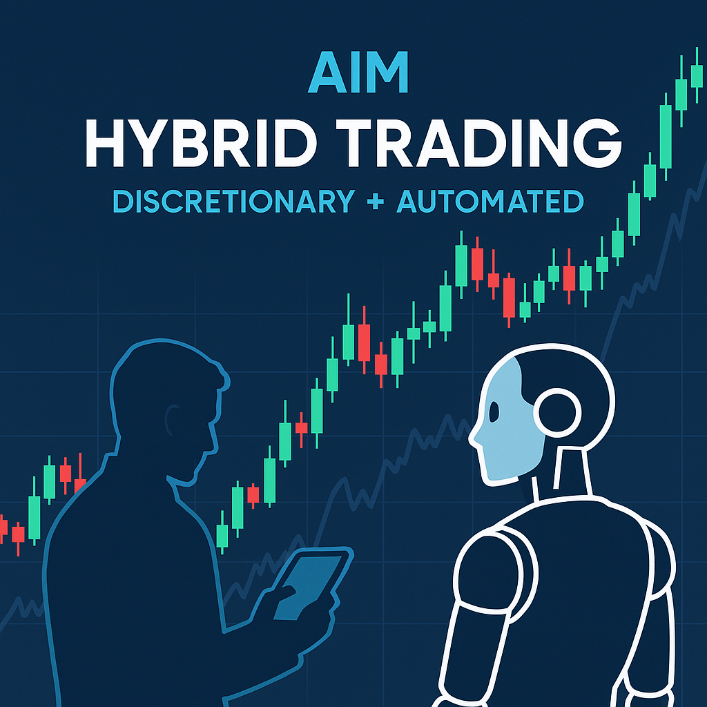

# AIM – Active Investment Management

### Descrizione

AIM (Active Investment Management) è un sistema evoluto di supporto decisionale per il trader, pensato per integrare trading discrezionale e automazione operativa.

Combina strumenti di analisi, automazione dei task ripetitivi, e controllo dinamico del rischio, per migliorare oggettività e disciplina nell'esecuzione.

# Funzionalità Principali

### Gestione del Rischio Dinamica (DVR)

- Calcolo automatico della size in base a SL, rischio e fattore di reinvestimento

- Controlli su perdita massima giornaliera e totale

- Color feedback per rischio accettabile o eccessivo

### Gestione Eventi Macroeconomici

- Parsing real-time dal calendario economico MQL5

- Salvataggio cronologia eventi e aggiornamenti programmati

- Filtro eventi per valuta, impatto ed esclusione settori non rilevanti

### Automazione Operativa

- Ordini a mercato e limite (Buy/Sell) con gestione TP/SL

- Break Even automatico (ABE) al raggiungimento di condizioni predefinite

- Chiusura massiva e monitoraggio ordini aperti/pending

### Analisi in Tempo Reale

- Andamento giornaliero, settimanale e mensile su asset selezionato

- Valutazione posizione prezzo rispetto a VWAP multi-banda

- Rilevamento della sessione attiva (Tokyo, London, New York)

### Interfaccia Grafica Custom

- 4 pannelli interattivi: Mercato, Operatività, Account, News

- Pulsanti rapidi per ordini e gestione ABE/DVR

- Input dinamici: prezzo limite, TP, SL, tipo ordine

# Casi d'uso

- Gestione strutturata del rischio nel trading discrezionale

- Automatizzazione controllata di operazioni ripetitive

- Integrazione di dati macroeconomici nell'analisi operativa

- Strutturazione di processi di esecuzione replicabili e oggettivi
